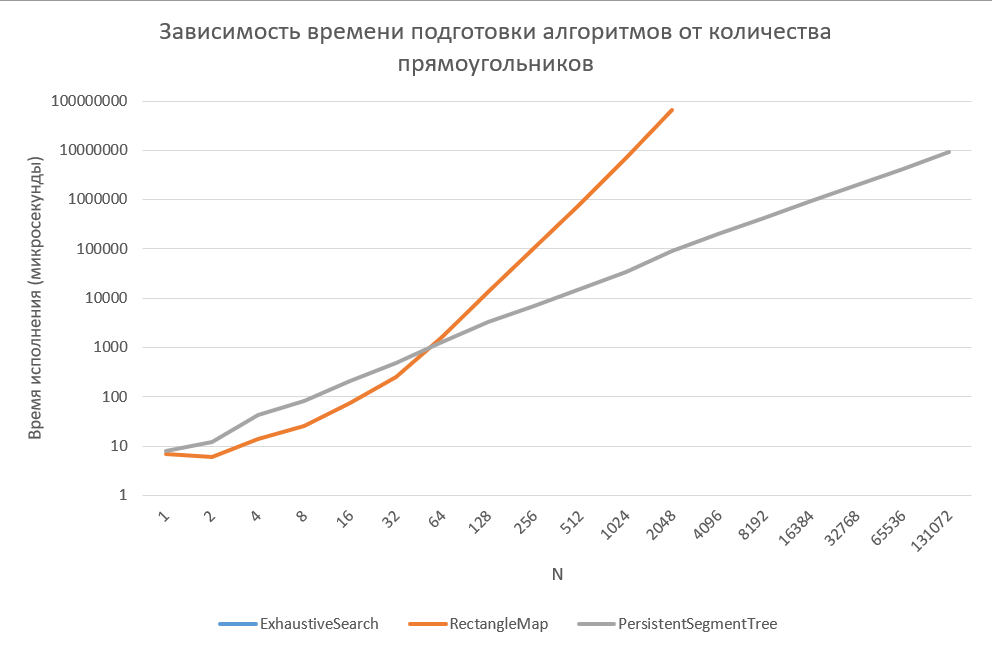
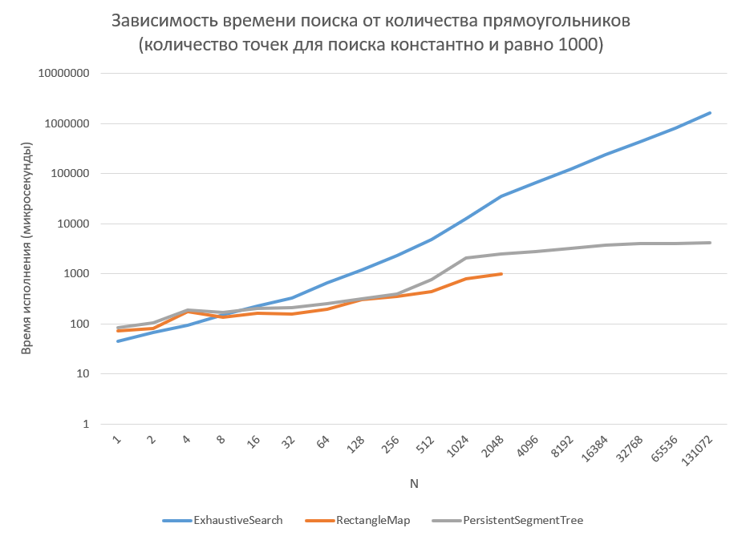
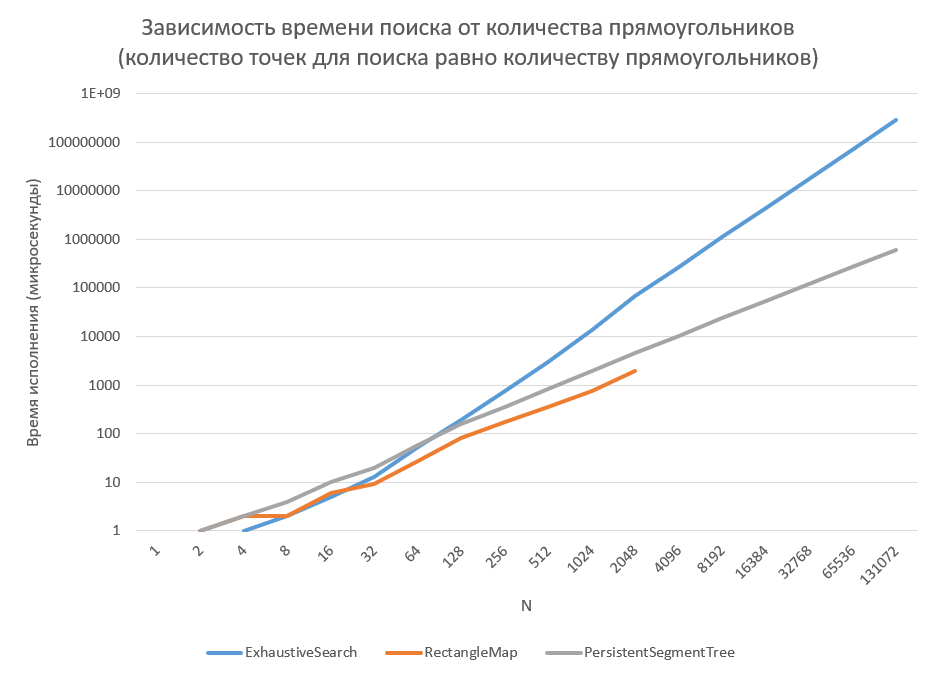
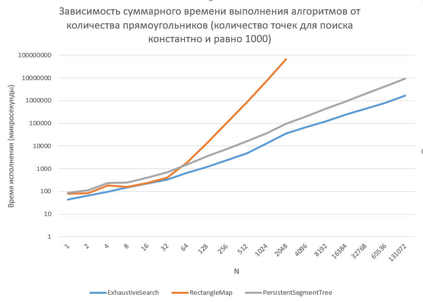
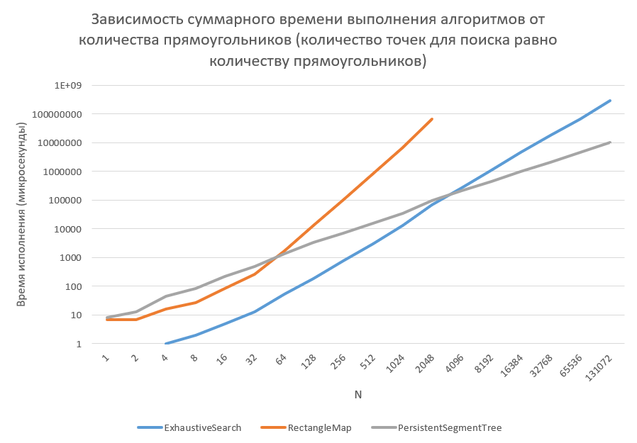

# Алгоритмы. Лабораторная работа №2

Работу выполнил [Максим Агеев](https://t.me/maxveega)

[Ссылка на репозиторий в GitHub](https://github.com/TobbyMax/AlgorithmsLab2)

#### Проходил контест c почты maageev_1@edu.hse.ru
*(Последнее решение прошедшее контест - третий алгоритм, представленный в лабораторной)*

**Реализации алгоритмов лежат в папке `solvers`, графики и сырые данные - в папке `data`, код для генерации и тестирования времени - в папке `benchmarks`.**

**Задача**: 
Даны прямоугольники на плоскости с углами в целочисленных координатах (\[1..10^9\], \[1..10^9\]).  Требуется как можно быстрее выдавать ответ на вопрос «Скольким прямоугольникам принадлежит точка (x,y)?» и подготовка данных должна занимать мало времени.

*Уточнение: только нижние границы включены => (x1<= x) && (x<x2) && (y1<=y) && (y<y2)*

**Цели**:
* Реализовать три разных решения задачи (алгоритм перебора, алгоритм на карте, алгоритм на дереве);
* Выяснить при каком объеме начальных данных и точек какой алгоритм эффективнее;
* Cделать выводы об эффективности каждого из алгоритмов.


## Вспомогательные классы.

### Точка на плоскости.

#### Код

```c++
#include <iostream>  
#include <vector>

struct Point {  
    int x;  
    int y;  
  
    Point() : x(0), y(0) {}  
  
    Point(int x_, int y_) : x(x_), y(y_) {}  
  
    Point(Point &p) : Point(p.x, p.y) {}  
  
    Point(Point const &p) : Point(p.x, p.y) {}  
};  
  
std::istream& operator>>(std::istream &in, Point &p) {  
    return in >> p.x >> p.y;  
}  
  
std::vector<Point> scanPoints(unsigned int n) {  
    std::vector<Point> points(n);  
    for (auto &p: points) {  
        std::cin >> p;  
    }  
    return points;  
}
```

### Прямоугольник.

#### Код

```c++
#include "point.h"  
  
struct Rectangle {  
    Point start;  
    Point finish;  
  
    Rectangle() : start(0, 0), finish(0, 0) {}  
  
    Rectangle(Point p1, Point p2) : start(p1), finish(p2) {}  
  
    Rectangle(int x1, int y1, int x2, int y2) : start(x1, y1), finish(x2, y2) {}  
  
    Rectangle(Rectangle &r) : start(r.start), finish(r.finish) {}  
  
    Rectangle(Rectangle const &r) : start(r.start), finish(r.finish) {}  
};  
  
std::istream& operator>>(std::istream &in, Rectangle &r) {  
    return in >> r.start >> r.finish;  
}  
  
std::vector<Rectangle> scanRectangles(unsigned int n) {  
    std::vector<Rectangle> rectangles(n);  
    for (auto &r: rectangles) {  
        std::cin >> r;  
    }  
    return rectangles;  
}
```


## Алгоритм 1. Алгоритм перебора.

Первый алгоритм (`ExhaustiveSearch`) реализует следующую логику: 
1. Подготовка отсутствует;
2. При поиске проходим по всем прямоугольникам и ищем среди них те, внутри которых лежит данная точка (сложность O(N)).

*Примечание:  в своей реализации ради однообразия всех классов с алгоритмами я сделал подготовку, заключающуюся в копировании всех прямоугольников внутрь класса (сложность O(N) + O(N) памяти)), однако в графиках я игнорирую это время, так как по сути можно передать массив прямоугольников напрямую в метод поиска `findRectangleCrossing`.*

#### Код

```c++
#include <vector>  
#include <iostream>  
#include <algorithm>  
#include "point.h"  
#include "rectangle.h"  
  
class ExhaustiveSearch {  
private:  
    std::vector<Rectangle> rectangles;  
public:  
    void prepareRectangles(const std::vector<Rectangle> &_rectangles) {  
        this->rectangles = _rectangles;  
    }  
  
    unsigned int findRectangleCrossing(const Point &p) {  
        unsigned int result = 0;  
        for (const auto &rect: rectangles) {  
            if (rect.start.x <= p.x && rect.start.y <= p.y && 
	            rect.finish.x > p.x && rect.finish.y > p.y) {  
                result++;  
            }  
        }  
        return result;  
    }  
  
    std::vector<unsigned int> getResults(std::vector<Point> points) {  
        std::vector<unsigned int> results(points.size());  
        for (int i = 0; i < points.size(); ++i) {  
            results[i] = findRectangleCrossing(points[i]);  
        }  
        return results;  
    }  
};
```


#### Сложность подготовки: **O(1)**
#### Сложность поиска: **O(N)**
#### Сложность по памяти: **O(1)**


## Алгоритм 2. Алгоритм на карте.

Второй  алгоритм (`RectangleMap`) реализует следующую логику: 
1.  Подготовка:
	 * Проходим по всем прямоугольникам, находим все уникальные значения x и y, сортируем множество X-координат и множество Y-координат (получаем 2 отсортированных множества: set из X-координат (`xUnique`) и set из Y-координат (`yUnique`));
	 * Проходим по массиву прямоугольников и заменяем их X-координаты на индексы соответствующих координат (соответсвующие координаты в отсортированном массиве уникальных значений *X* ищем бинарным поиском, аналогично для *Y*) в полученном множестве X-координат, а Y-координаты на индексы соответствующих координат в полученном множестве Y-координат (сложность O(N));
	 * Строим "карту" прямоугольников (сложность O(N^3)):
			 a) Создаем двумерный массив целых чисел (размерами `yUnique.size()` на `xUnique.size()`), изначально заполненный нулями;
			 b) Для каждого сжатого прямоугольника прибавляем по единице к значению каждого элемента матрицы, расположенного в прямоугольной области от  сжатых координат начала прямоугольника (`start.x` , `start.y`) до сжатых координат конца прямоугольника (`finish.x` , `finish.y`) (начало включительно, а конец не включительно);
2. Поиск:
	* Сжимаем координаты данной точки - с помощью бинарного поиска в массиве уникальных значений *X* находим индекс последнего элемента меньше либо равного координате `x` данной точки (если такой индекс не был найден, то точка определенно находится вне всех прямоугольников - возвращаем `0`), аналогичную операцию производим с *y*-координатой (сложность O(log(N)));
	* Возвращаем значение, находящееся по найденным индексам в матрице-карте - это и будет ответ (сложность O(1));

#### Код

```c++
#include <iostream>  
#include <vector>  
#include <map>  
#include <set>  
#include <memory>  
#include <algorithm>  
#include "rectangle.h"  
  
class RectangleMap {  
private:  
    std::vector<std::vector<unsigned int>> rectangleMap;  
    std::vector<int> xUnique;  
    std::vector<int> yUnique;  
  
    static int compressCoordinate(const std::vector<int> &compressed, int coordinate) {  
        return (int)(std::lower_bound(compressed.begin(), compressed.end(), coordinate) 
				    - compressed.begin());  
    }  
  
    Point compressRectanglePoint(const Point &p) {  
        Point mapped;  
        mapped.x = compressCoordinate(xUnique, p.x);  
        mapped.y = compressCoordinate(yUnique, p.y);  
        return mapped;  
    }  
  
    void mapRectangles(const std::vector<Rectangle> &rectangles) {  
        rectangleMap = std::vector<std::vector<unsigned int>>(yUnique.size());  
        for (auto &row: rectangleMap) {  
            row = std::vector<unsigned int>(xUnique.size());  
        }  
        for (auto &r: rectangles) {  
            Point start = compressRectanglePoint(r.start);  
            Point finish = compressRectanglePoint(r.finish);  
  
            for (auto i = start.y; i < finish.y; i++) {  
                for (auto j = start.x; j < finish.x; j++) {  
                    rectangleMap[i][j] += 1;  
                }  
            }  
        }  
    }  
  
    void getUniqueCoordinates(const std::vector<Rectangle> &rectangles) {  
        std::set<int> x_set;  
        std::set<int> y_set;  
  
        for (const auto &r: rectangles) {  
            x_set.insert(r.start.x);  
            y_set.insert(r.start.y);  
            x_set.insert(r.finish.x);  
            y_set.insert(r.finish.y);  
        }  
        xUnique = std::vector<int>();  
        xUnique.insert(xUnique.begin(), x_set.begin(), x_set.end());  
        yUnique = std::vector<int>();  
        yUnique.insert(yUnique.begin(), y_set.begin(), y_set.end());  
    }  
  
public:  
    void prepareRectangles(const std::vector<Rectangle> &rectangles) {  
        getUniqueCoordinates(rectangles);  
        mapRectangles(rectangles);  
    }  
  
    unsigned int findRectangleCrossing(const Point &p) {  
        auto pos_x = std::upper_bound(xUnique.begin(), xUnique.end(), p.x);  
        if (pos_x == xUnique.end() || pos_x == xUnique.begin()) {  
            return 0;  
        }  
        auto pos_y = std::upper_bound(yUnique.begin(), yUnique.end(), p.y);  
        if (pos_y == yUnique.end() || pos_y == yUnique.begin()) {  
            return 0;  
        }  
        auto y = pos_y - yUnique.begin() - 1;  
        auto x = pos_x - xUnique.begin() - 1;  
        return rectangleMap[y][x];  
    }  
  
    std::vector<unsigned int> getResults(std::vector<Point> points) {  
        std::vector<unsigned int> results(points.size());  
        for (int i = 0; i < points.size(); ++i) {  
            results[i] = findRectangleCrossing(points[i]);  
        }  
        return results;  
    }  
};
```


#### Сложность подготовки: **O(N^3)**
#### Сложность поиска: **O(log(N))**
#### Сложность по памяти: **O(N^2)**


## Алгоритм 3. Алгоритм на дереве.

Второй  алгоритм (`RectangleMap`) реализует следующую логику: 
1.  Подготовка:
	 * Проходим по всем прямоугольникам, находим все уникальные значения x и y, сортируем множество X-координат и множество Y-координат (получаем 2 отсортированных множества: set из X-координат (`xUnique`) и set из Y-координат (`yUnique`));
	 * Проходим по массиву прямоугольников и заменяем их X-координаты на индексы соответствующих координат (соответсвующие координаты в отсортированном массиве уникальных значений *X* ищем бинарным поиском, аналогично для *Y*) в полученном множестве X-координат, а Y-координаты на индексы соответствующих координат в полученном множестве Y-координат (сложность O(N));
	 * Создаем массив линий-модификаторов `modifiers` (сложность O(N)): для каждого сжатого прямоугольника добавляем в этот массив 2 объекта `RectangleModifier`, содержащих по 4 поля: 
			 a) один объект будет состоять из начальной координаты `x`, обеих *y*-координат и пометки, что это начало прямоугольника (1);
			 b) второй объект будет состоять из конечной координаты `x`, обеих *y*-координат и указателя, что это конец прямоугольника (-1);
	* Полученный массив `modifiers` сортируем по координате `x` (сложность O(N * log(N))) ;
	* Строим исхожное дерево отрезков (с модификаторами) на сжатых кординатах `y` (изначально все значения 0) (сложность O(N * log(N)));
	* Для каждой "сжатой" *x*-координаты (для каждого индекса `xUnique`) берем все линии-модификаторы из `modifiers` с соответствующей координатой `x` и модифицируем дерево отрезков на отрезке от `y1` до `y2` (`y1` - включительно, `y2` - не включительно), при этом для каждой "сжатой" *x*-координаты сохраняем состояние дерева отрезков, поэтому модификацию производим не напрямую на дереве предыдущего состояния а с копированием пути (итоговая сложность всех модификаций O(N * log(N)));
	* В итоге получаем персистентное дерево отрезков с модификаторами (для каждой "сжатой" *x*-координаты хранится дерево отрезков соответствующего состояния);
2. Поиск:
	* Сжимаем координаты данной точки - с помощью бинарного поиска в массиве уникальных значений *X* находим индекс последнего элемента меньше либо равного координате *x* данной точки (если такой индекс не был найден, то точка определенно находится вне всех прямоугольников - возвращаем `0`), аналогичную операцию производим с *y*-координатой (сложность O(log(N)));
	* Обращаемся к дереву отрезков состояния под номером *x-сжатого*, и в нем спускаемся к нужному *y-сжатому*, собирая при спуске до листа все модификаторы и прибавляя их к результату (сложность O(log(N))).

*Примечание: линии-модификаторы - придуманное названиие, в коде я их назвал `RectangleModifier`.*

#### Код

```c++
#include <iostream>  
#include <algorithm>  
#include <vector>  
#include <map>  
#include <set>  
#include <memory>  
#include "rectangle.h"  
  
  
class PersistentSegmentTree {  
private:  
    struct Node;  
  
    std::vector<int> xUnique;  
    std::vector<int> yUnique;  
    std::vector<std::shared_ptr<Node>> states;  
  
    struct RectangleModifier {  
        int x, y1, y2;  
        int modifier;  
  
        RectangleModifier() : x(0), y1(0), y2(0), modifier(0) {}  
  
        RectangleModifier(int _x, int _y1, int _y2, int mod) : x(_x), y1(_y1), y2(_y2), modifier(mod) {}  
    };  
  
    class ModifierComparator {  
    public:  
        bool operator()(RectangleModifier rm1, RectangleModifier rm2) {  
            if (rm1.x == rm2.x) {  
                return rm1.modifier < rm2.modifier;  
            }  
            return rm1.x < rm2.x;  
        }  
    };  
  
    struct Node {  
        unsigned int modifier;  
        unsigned int leftBound;  
        unsigned int rightBound;  
        std::shared_ptr<Node> left;  
        std::shared_ptr<Node> right;  
  
        Node(unsigned int l, unsigned int r) : leftBound(l), rightBound(r) {  
            modifier = 0;  
            left = nullptr;  
            right = nullptr;  
        }  
  
        Node() : Node(0, 0) {}  
  
        Node(Node const &node) : Node(node.leftBound, node.rightBound) {  
            modifier = node.modifier;  
            left = node.left;  
            right = node.right;  
        }  
    };  
  
    std::shared_ptr<Node> createTree(unsigned int l, unsigned int r) {  
        auto root = std::make_shared<Node>(l, r);  
        if (l == r) {  
            return root;  
        }  
        unsigned int mid = (l + r) / 2;  
        root->left = createTree(l, mid);  
        root->right = createTree(mid + 1, r);  
        return root;  
    }  
  
    std::shared_ptr<Node> modify(const std::shared_ptr<Node> &cur, int l, int r, int mod) {  
        if (cur->leftBound >= r || cur->rightBound < l) {  
            return cur;  
        }  
        if (cur->leftBound >= l && cur->rightBound < r) {  
            auto newRoot = std::make_shared<Node>(*cur);  
            newRoot->modifier += mod;  
            return newRoot;  
        } else {  
            auto newRoot = std::make_shared<Node>(*cur);  
            newRoot->left = modify(cur->left, l, r, mod);  
            newRoot->right = modify(cur->right, l, r, mod);  
            return newRoot;  
        }  
    }  
  
    unsigned int get(const std::shared_ptr<Node> &cur, long long j) {  
        unsigned int sum = 0;  
        if (cur->right != nullptr && cur->right->leftBound <= j) {  
            sum += get(cur->right, j);  
        } else if (cur->left != nullptr && cur->left->rightBound >= j) {  
            sum += get(cur->left, j);  
        }  
        sum += cur->modifier;  
        return sum;  
    }  
  
    static int compressCoordinate(const std::vector<int> &compressed, int coordinate) {  
        return (int) (std::lower_bound(compressed.begin(), compressed.end(), coordinate) - compressed.begin());  
    }  
  
    Point compressRectanglePoint(const Point &p) {  
        Point mapped;  
        mapped.x = compressCoordinate(xUnique, p.x);  
        mapped.y = compressCoordinate(yUnique, p.y);  
        return mapped;  
    }  
  
    void getUniqueCoordinates(const std::vector<Rectangle> &rectangles) {  
        std::set<int> x_set;  
        std::set<int> y_set;  
  
        for (const auto &r: rectangles) {  
            x_set.insert(r.start.x);  
            y_set.insert(r.start.y);  
            x_set.insert(r.finish.x);  
            y_set.insert(r.finish.y);  
        }  
        xUnique = std::vector<int>();  
        xUnique.insert(xUnique.begin(), x_set.begin(), x_set.end());  
        yUnique = std::vector<int>();  
        yUnique.insert(yUnique.begin(), y_set.begin(), y_set.end());  
    }  
  
    std::vector<RectangleModifier> getRectangleModifiers(const std::vector<Rectangle> &rectangles) {  
        std::vector<RectangleModifier> modifiers(rectangles.size() * 2);  
        int i = 0;  
        for (const auto &r: rectangles) {  
            Point start = compressRectanglePoint(r.start);  
            Point finish = compressRectanglePoint(r.finish);  
            modifiers[2 * i] = RectangleModifier(start.x, start.y, finish.y, 1);  
            modifiers[2 * i + 1] = RectangleModifier(finish.x, start.y, finish.y, -1);  
            i++;  
        }  
        std::sort(modifiers.begin(), modifiers.end(), ModifierComparator());  
        return modifiers;  
    }  
  
    void getTreeStates(const std::vector<Rectangle> &rectangles) {  
        std::vector<RectangleModifier> modifiers = getRectangleModifiers(rectangles);  
  
        states = std::vector<std::shared_ptr<Node>>(xUnique.size());  
        std::shared_ptr<Node> initState;  
        if (yUnique.empty()) {  
            initState = nullptr;  
        } else {  
            initState = createTree(0, yUnique.size() - 1);  
        }  
        unsigned int modifierIndex = 0, stateIndex = 0;  
        for (int x = 0; x < xUnique.size(); ++x) {  
            std::shared_ptr<Node> curState;  
            if (stateIndex == 0) {  
                curState = initState;  
            } else {  
                curState = states[stateIndex - 1];  
            }  
            while (modifiers[modifierIndex].x == x) {  
                curState = modify(curState, modifiers[modifierIndex].y1,  
                                  modifiers[modifierIndex].y2, modifiers[modifierIndex].modifier);  
                modifierIndex++;  
            }  
            states[stateIndex++] = curState;  
        }  
    }  
  
public:  
    void prepareRectangles(const std::vector<Rectangle> &rectangles) {  
        getUniqueCoordinates(rectangles);  
        getTreeStates(rectangles);  
    }  
  
    unsigned int findRectangleCrossing(const Point &p) {  
        auto pos_x = std::upper_bound(xUnique.begin(), xUnique.end(), p.x);  
        if (pos_x == xUnique.end() || pos_x == xUnique.begin()) {  
            return 0;  
        }  
        auto pos_y = std::upper_bound(yUnique.begin(), yUnique.end(), p.y);  
        if (pos_y == yUnique.end() || pos_y == yUnique.begin()) {  
            return 0;  
        }  
        auto y = pos_y - yUnique.begin() - 1;  
        auto x = pos_x - xUnique.begin() - 1;  
        return get(states[x], y);  
    }  
  
    std::vector<unsigned int> getResults(std::vector<Point> points) {  
        std::vector<unsigned int> results(points.size());  
        for (int i = 0; i < points.size(); ++i) {  
            results[i] = findRectangleCrossing(points[i]);  
        }  
        return results;  
    }  
};
```


#### Сложность подготовки: **O(N \* log(N))**
#### Сложность поиска: **O(log(N))**
#### Сложность по памяти:  **O(N \* log(N))**


## Генерация данных

Для генерации прямоугольников и точек использован рекомендованный в описании лабораторной способ:
* Для тестового набора прямоугольников использован набор вложенных друг в друга прямоугольников с координатами с шагом больше 1:
		Rectangle {(10 * i, 10 * i), (10 * (2 * N - i), 10 * (2 * N-i))};
* Для тестового набора точек использован неслучайный набор точек, распределенных почти равномерно по ненулевому пересечению прямоугольников, полученный с помощью хэш-функция от i с разным базисом для x и y.   
		Point {(Px * i)^31 % (20 * N), (Py * i)^31 % (20 * N)}, 
		где Px и Py различные между собой большие простые чила.

#### Код

```c++
#define P_X 131  
#define P_Y 113 
```

```c++
std::vector<Rectangle> generateRectangles(int n) {  
    std::vector<Rectangle> rectangles(n);  
    for (int i = 0; i < n; ++i) {  
        rectangles[i] = Rectangle({10*i, 10*i}, {10*(2*n-i), 10*(2*n-i)});  
    }  
    return rectangles;  
}  
```

```c++
// Функция возвдения в степень по модулю
unsigned long long powMod(unsigned long long base, unsigned long long exp, unsigned long long modulus) {  
    if (modulus == 1) {  
        return 0;  
    }  
    base %= modulus;  
    unsigned long long result = 1;  
    while (exp > 0) {  
        if (exp % 2 == 1) {  
            result = (result * base) % modulus;  
        }  
        base = (base * base) % modulus;  
        exp >>= 1;  
    }  
    return result;  
}  
  
int getPointCoordinate(int seed, int i, int n) {  
    return (int)powMod(seed * i, 31, 20 * n);  
}  
  
std::vector<Point> generatePoints(int n) {  
    std::vector<Point> points(n);  
    for (int i = 0; i < n; ++i) {  
        points[i] = Point(getPointCoordinate(P_X, i, n),  
                          getPointCoordinate(P_Y, i, n));  
    }  
    return points;  
}
```

## Запуск

Для каждого значения N (1 <= N <= 2^18 с увеличением в 2 раза за один шаг) производим 10 тестов для каждого алгоритма и замеряем время выполнения: подготовки, поиска растущего числа точек, поиска фиксированного числа точек и суммарного времения выполнения, затем высчитываем среднее время, чтобы добиться точности и нивелировать влияние на время выпонения таких факторов, как другие запущенные в текущий момент на ПК процессы. Результаты запусков (среднее время выполнения каждого алгоритма для конкретного M) записываем в файлы *prep_results.txt, find_results.txt, find_fixed_results.txt, sum_results.txt и sum_fixed_results.txt*.

Запуск производится в IDE Сlion в компиляторе GNU 11.2.0 для C++ (стандарт 20).

#### Код

```c++
#define FIXED 1000  
#define TESTS_COUNT 10  
  
enum Algorithm {Exhaustive_Search, Rectangle_Map, Persistent_Segment_Tree};  
  
  
long long measure_time(const std::function<void(void)> &method) {  
    auto t0 = std::chrono::high_resolution_clock::now();  
    method();  
    auto t1 = std::chrono::high_resolution_clock::now();  
    return std::chrono::duration_cast<std::chrono::microseconds>(t1-t0).count();  
}  
  
void bench() {  
    auto psTree = PersistentSegmentTree();  
    auto rectMap = RectangleMap();  
    auto fullSearch = ExhaustiveSearch();  
  
    std::ofstream prepResults("..\\prep_results.txt");  
    std::ofstream findResults("..\\find_results.txt");  
    std::ofstream findFixedResults("..\\find_fixed_results.txt");  
    std::ofstream sumResults("..\\sum_results.txt");  
    std::ofstream sumFixedResults("..\\sum_fixed_results.txt");  
  
    prepResults << "n\tExhaustiveSearch\tRectangleMap\tPersistentSegmentTree\n";  
    findResults << "n\tExhaustiveSearch\tRectangleMap\tPersistentSegmentTree\n";  
    findFixedResults << "n\tExhaustiveSearch\tRectangleMap\tPersistentSegmentTree\n";  
    sumResults << "n\tExhaustiveSearch\tRectangleMap\tPersistentSegmentTree\n";  
    sumFixedResults << "n\tExhaustiveSearch\tRectangleMap\tPersistentSegmentTree\n";  
  
    for (int n = 1; n < 512*512; n *= 2) {  
        std::cout << "\nSize: " << n << std::endl;  
  
        auto rectangles = generateRectangles(n);  
        auto points = generatePoints(n);  
        auto pointsFixed = generatePoints(FIXED);  
  
        std::vector<unsigned long long> sumPrep(3);  
        std::vector<unsigned long long> sumFind(3);  
        std::vector<unsigned long long> timePrep(3);  
        std::vector<unsigned long long> timeFind(3);  
        sumFind[Exhaustive_Search] = sumFind[Rectangle_Map] = sumFind[Persistent_Segment_Tree] = 0;  
        sumPrep[Exhaustive_Search] = sumPrep[Rectangle_Map] = sumPrep[Persistent_Segment_Tree] = 0;  
  
        std::vector<unsigned long long> sumFindFixed(3);  
        std::vector<unsigned long long> timeFindFixed(3);  
        sumFindFixed[Exhaustive_Search] = sumFindFixed[Rectangle_Map] = sumFindFixed[Persistent_Segment_Tree] = 0;  
        sumPrep[Exhaustive_Search] = sumPrep[Rectangle_Map] = sumPrep[Persistent_Segment_Tree] = 0;  
  
        // Делаем 10 запусков для точности значений времени  
        for (int i = 0; i < TESTS_COUNT; ++i) {  
            std::cout << i << " ";  
            psTree = PersistentSegmentTree();  
            rectMap = RectangleMap();  
            fullSearch = ExhaustiveSearch();  
  
//            sumPrep[Exhaustive_Search] += measure_time([&fullSearch, &rectangles]() {  
            fullSearch.prepareRectangles(rectangles);  
//            });  
            sumFind[Exhaustive_Search] += measure_time([&fullSearch, &points]() {  
                fullSearch.getResults(points);  
            });  
            sumFindFixed[Exhaustive_Search] += measure_time([&fullSearch, &pointsFixed]() {  
                fullSearch.getResults(pointsFixed);  
            });  
  
            if (n <= 2048) {  
                sumPrep[Rectangle_Map] += measure_time([&rectMap, &rectangles]() {  
                    rectMap.prepareRectangles(rectangles);  
                });  
                sumFind[Rectangle_Map] += measure_time([&rectMap, &points]() {  
                    rectMap.getResults(points);  
                });  
                sumFindFixed[Rectangle_Map] += measure_time([&rectMap, &pointsFixed]() {  
                    rectMap.getResults(pointsFixed);  
                });  
            }  
  
            sumPrep[Persistent_Segment_Tree] += measure_time([&psTree, &rectangles]() {  
                psTree.prepareRectangles(rectangles);  
            });  
            sumFind[Persistent_Segment_Tree] += measure_time([&psTree, &points]() {  
                psTree.getResults(points);  
            });  
            sumFindFixed[Persistent_Segment_Tree] += measure_time([&psTree, &pointsFixed]() {  
                psTree.getResults(pointsFixed);  
            });  
        }  
        // Вычисляем среднее время за 10 запусков  
        for (auto i = 0; i < 3; i++) {  
            timePrep[i] = sumPrep[i] / TESTS_COUNT;  
            timeFind[i] = sumFind[i] / TESTS_COUNT;  
            timeFindFixed[i] = sumFindFixed[i] / TESTS_COUNT;  
        }  
        // Записываем данные в текстовый файл  
        prepResults << n << "\t";  
        findResults << n << "\t";  
        findFixedResults << n << "\t";  
        sumResults << n << "\t";  
        sumFixedResults << n << "\t";  
        for (auto i = 0; i < 3; i++) {  
            prepResults << timePrep[i] << "\t";  
            findResults << timeFind[i] << "\t";  
            findFixedResults << timeFindFixed[i] << "\t";  
            sumResults << timePrep[i] + timeFind[i] << "\t";  
            sumFixedResults << timePrep[i] + timeFindFixed[i] << "\t";  
        }  
        prepResults << "\n";  
        findResults << "\n";  
        findFixedResults << "\n";  
        sumResults << "\n";  
        sumFixedResults << "\n";  
    }  
}
```


## Графики

После запуска копируем полученные данные из текстового файла в файл PI1_Ageev_algolab1.xlsx  и строим по ним графики.

Графики и данные приложены в файле:
![[PI1_Ageev_algolab1.xlsx]]


## Выводы

### По времени подготовки



1. С точки зрения подготовки самым быстрым алгоритмом является **алгоритм перебора**, так как он не требует подготовки;
2. На небольшом количестве прямоугольников (N < 64) подготовка **алгоритма на карте** происходит в среднем в 2 раза быстрее (несмотря на то что сложность алгоритма больше, чему дерева, так как константа меньше), чем **алгоритма на дереве**, однако при увеличении N время выполнения подготовки **алгоритма на карте** очень быстро растет в связи с кубической сложностью алгоритма и уже при N = 2^9 он требует в 50 раз больше времени на подготовку, а при N = 2^11 - в 1000 раз больше времени на подготовку, чем **алгоритм на карте** требующий O(N \* log(N)) операций на подготовку.

### По времени поиска

#### При фиксированном количестве точек для поиска (M = 1000)



1. При маленьком количестве прямоугольников (N < 8) **полный перебор** работает быстрее всего (хотя и с небольшим отрывом) , так как несмотря на сложность O(N) у константа его выполнения меньше, чем у остальных алгоритмов, имеющих логарифмическую сложность поиска;
2. Так как **алгоритм перебора** имеет линейную сложность поиска, то при увеличении количества прямоугольников **полный перебор** начинает сильно проигрывать по времени выполнения остальным алгоритмам (при N = 2^11 он выпоняется более чем в 10 раз медленнее, а при N = 2^18 требует уже в 400 раз больше времени, чем **алгоритм на дереве**);
3. Так как **алгоритмы на карте и на дереве** имеют логарифмическую сложность, то при увеличении N время поиска у них увеличивается незначительно, при увеличении количества прямоугольников в 256 раз (от 1 до 256), время выполнения  поиска этих алгоритмов увеличилось не более чем в 5 раз;

#### При количестве точек для поиска равном числу прямоугольников (M = N)



1. При малом количестве точек и прямоугольников (N < 128) все три алгоритма одинаково эффективны на поиске.
2. При этом, так как **алгоритм на дереве** помимо бинарного поиска по сжатым координатам требует ещё и прохода по дереву за логарифмичекое время, то константа **алгоритма на дереве** больше, чем у **алгоритма на карте**, поэтому время поиска **алгоритма на дереве** в среднем в 1.5 - 2 раза больше, чем у **алгоритма на карте**.
3. Остальные выводы по этому графику эквивалентны выводам по предыдущему.

### По суммарному времени выполнения

#### При фиксированном количестве точек для поиска (M = 1000)



1. При фикcированном количестве точек наиболее эффективным оказывается **алгоритм перебора**, так как он не требует подготовки и имеет итоговую сложность O(N), тогда как **алгоритм на карте** требует в сумме O(N^3) + O(log(N)) = O(N^3) операций, а **алгоритм на дереве** требует в сумме O(N \* log(N)) + O(log(N)) = O(N \* log(N)) операций;
2. При этом **алгоритм на дереве** показывает себя лишь на порядок хуже (не более чем в 10 раз медленнее);
3. Суммарное время выполнения **алгоритма на карте** при маленьких значениях N (N < 64) меньше, чем у **алгоритма на дереве**, однако он быстро растет с увеличением N за счёт кубической сложности подготовки, поэтому при N = 256 карта требует в сумме в 14 раз больше времени, чем **алгоритм на дереве**, а при N = 2048  - на 3 порядка (в 1000 раз) больше времени;

#### При количестве точек для поиска равном числу прямоугольников (M = N)



1. Итоговая сложность алгоритмов при пропорционально растущих значениях N и M будет составлять:
	* O(N) \* O(N)  = O(N^2) для **алгоритма перебора**;
	* O(N \* log(N)) + O(N) \* O(log(N))  = O(N \* log(N)) для **алгоритма на дереве**;
	* O(N^3) + O(N) \* O(log(N))  = O(N^3) для **алгоритма на карте**;
2. Поэтому при небольших N (N < 2^12) **алгоритм перебора** также работает быстрее всего за счет меньшей константы, однако при увеличении N (N > 2^12) за счет квадратичной сложности он проигрывает **алгоритму на дереве**, требующему суммарно N \* log(N) операций;
3. Выводы об алгоритме на карте идентичны выводам по предыдущему графику.

## Итог:

1. **Алгоритм перебора** не требует подготовки, но медленно отвечает на запросы, поэтому он наиболее эффективен, когда количество точек для поиска ограничено (фиксировано) и сильно меньше количества прямоугольников либо когда число прямоугольников и точек не очень велико (N, M < 4000);
2. **Алгоритм на карте** наиболее быстро отвечает на запросы, однако требует больше всего памяти (O(N^2)) и больше всего времени для подготовки (O(N^3)), поэтому построение карты эффективно только при количестве прямоугольников N < 64,  но поиск эффективен при любом количестве прямоугольников и точек;
	* **Алгоритм на карте** может быть применим только тогда, когда необходимо один раз подготовить данные по входным прямоугольникам (но если данных очень много, то это займет много времени и места на диске), а затем делать неограниченное количество запросов точек;
1. **Алгоритм на дереве** более быстр в подготовке O(N \* log(N)) и занимает меньшую память O(N \* log(N)), чем **алгоритм на карте**, при этом он отвечает на запросы быстрее, чем  **алгоритм перебора**, и осуществляет поиск лишь на константу медленнее, чем **алгоритм на карте**, поэтому он наиболее эффективен при большом количестве прямоугольников и большом количестве точек (N, M > 4000).
